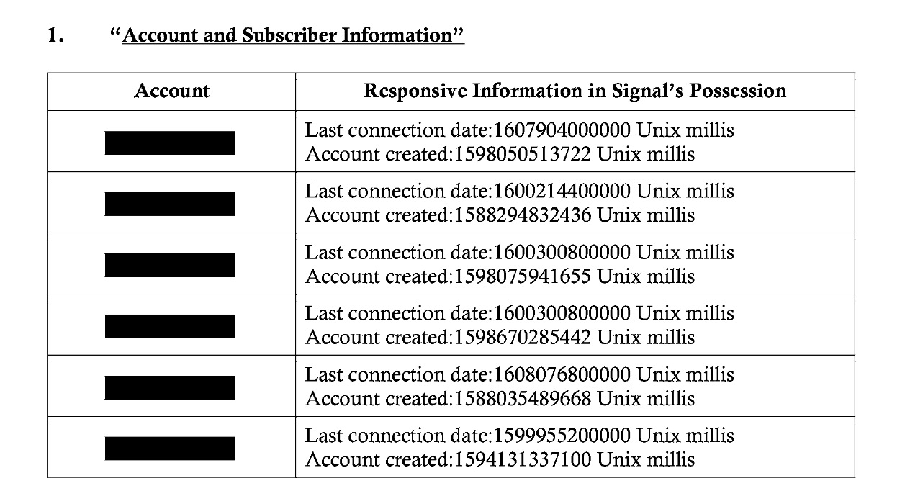

# Why you should use Signal Messenger.

Signal Messenger is an open source project that is focused on privacy secured messaging, "open source" meaning the code is available to everyone. You might think that this would lead to less security and more chance at vulnerability. But no, since everyone can see the code and contribute to it people will notice the vulnerabilities much faster. Now "privacy" meaning only you and the receiver(s) can see anything you send. Not even Signal themselves can see your messanges, nor do they store it.

# Why does my privacy matter?

Anyone who says that their privacy doesn't matter is clueless. Imagine you are sending a letter, someone is able to see you write that letter, the mail man opens your letter and looks at it, reads it... and then finally your recipient receives it and reads it. Doesn't that feel invasive? For me it does!

When you use a messenger like WhatsApp, eventhough they claim to be end to end encrypted, it's most likely a lie. And therefore that means you should expect WhatsApp to be rea ding your every message...

# "I have nothing to hide!"

If you think you have nothing to hide, do you tell your parents everything? Do you tell your partner everything? Do you tell your friends everything? I thought so.

# Proof that Signal is private.

Take a look at [this](https://signal.org/bigbrother/central-california-grand-jury/), it's a goverment subpoena, the subpoena basically says "give me all the data you have on this phone number". And here is the data they where able to provide: 

Basically the goverment gave them the phone number they wanted information on, and all they where able to provide is "Last connection date" and "Account created date".

If you want to know the technology behind signal you should look up how end to end encryption works.

Thanks for reading!

